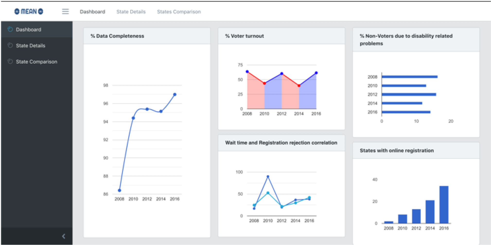
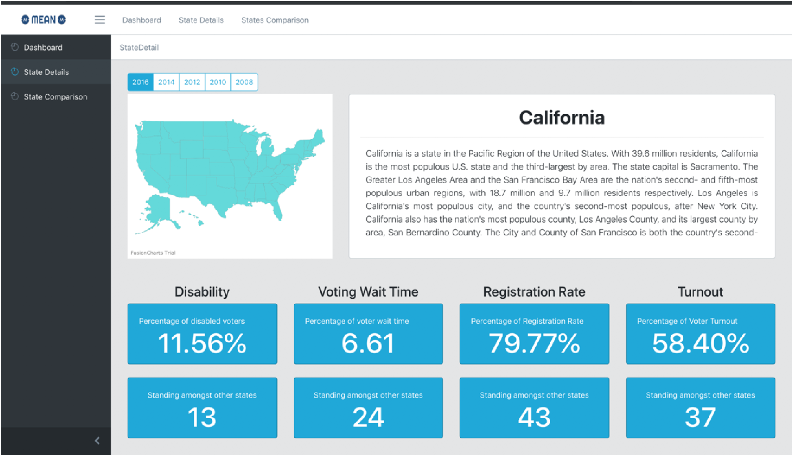
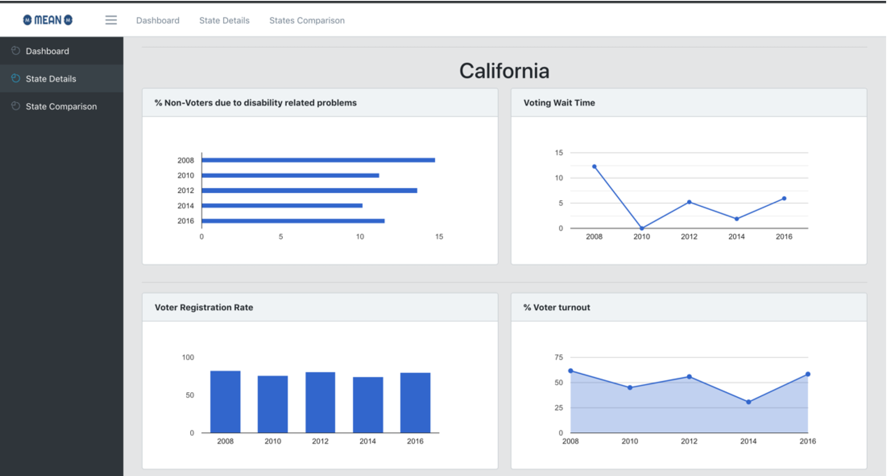
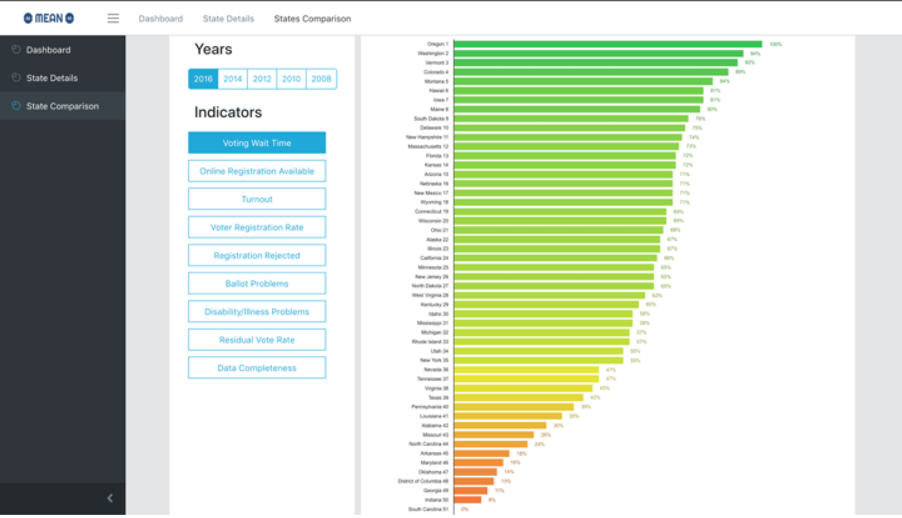

# Election Data Visualization
This application provides a very unique view of the USA election data collected by using 9 different Key Performance Indicators (KPI) for each state. Using these KPIs, each state can be ranked and analyzed individually or with all the other states. It can help "Federal election committee (FEC)" in monitoring and taking decisions on state's performance. It can also help "Geo-Political/history students/professor" to analyse election data.

The election dashboard prompts following decision making:
 - States where proper arrangements should be made for voters with disability conditions.
 - Make the election process smoother like decreasing the wait time for voters.
 - Data completeness- Helps to improve the ways/methods we can collect the data.
 - Voter Turnout - Steps to be taken to encourage people to exercise voting especially young people.
 - State comparison- compare states, make decisions such as if a state is performing good, follow the strategies or methods adopted by the good performing state to improve the performance in the underperforming states.

## How to run
1. Download the source code.
2. Start the server:
  - Go to server folder
  - Run npm install
  - Run npm start
3. Start the client:
  - Go to client folder
  - Run npm install
  - Run npm start
  
## Dashboard screenshots:
1. National Average View

2. State Level Views

3. States Comparison View

